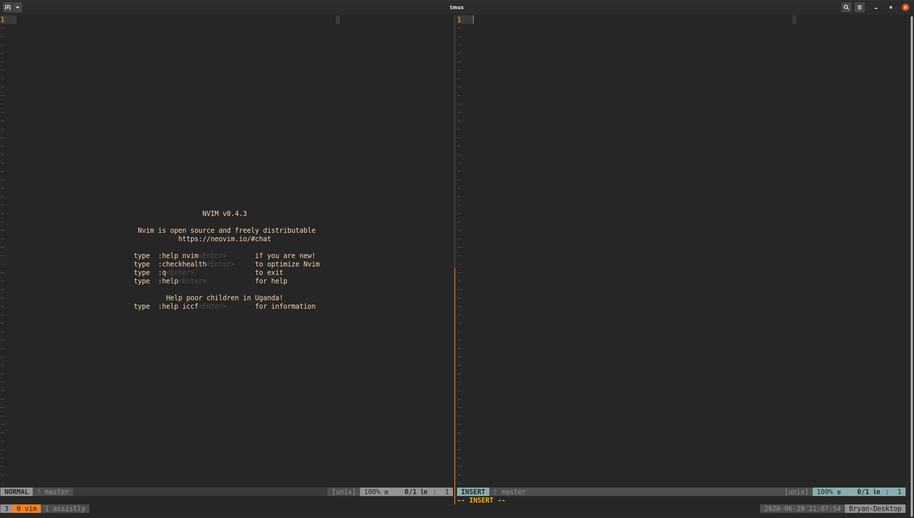

# Gruvbox colours for tmux

Changes the default colours of [tmux](https://github.com/tmux/tmux) to something that works well with the [gruvbox colorscheme](https://github.com/morhetz/gruvbox).
This project is a fork of [tmux-gruvbox](https://github.com/egel/tmux-gruvbox) and heavily inspired by [tmux-gruvbox-truecolor](https://github.com/LawAbidingCactus/tmux-gruvbox-truecolor).
Only the arrows and colours have been changed to better fit the gruvbox theme and my personal preferences.



## Installation through the [Tmux Plugin manager](https://github.com/tmux-plugins/tpm)
### Tmux Plugin Manager
Add this repository as a plugin to your `.tmux.conf`:
```tmux
set -g @plugin 'bryanwesterveld/gruvbox-colours-for-tmux'
```
Press `<prefix> + I` to reload tmux with the plugin enabled.

